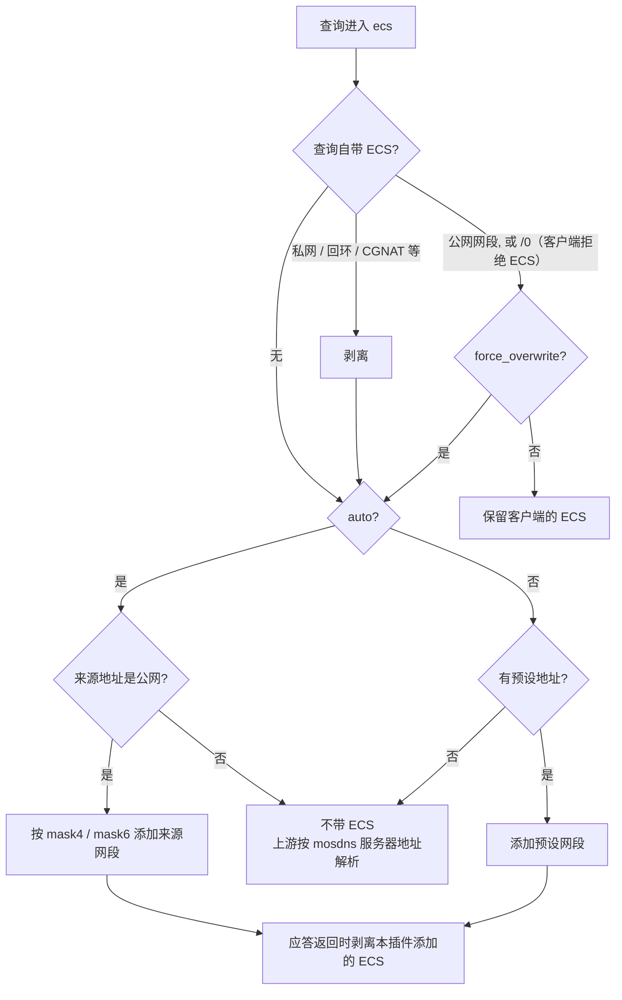
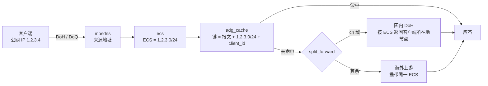
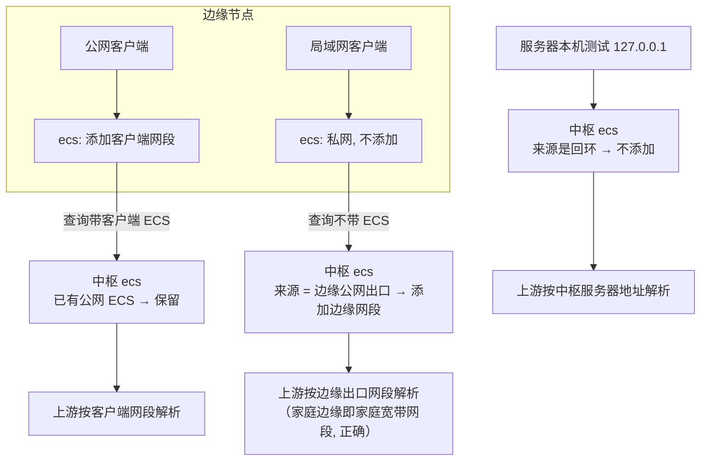

# ecs

给查询附加 EDNS Client Subnet（RFC 7871），让上游和权威服务器按**客户端**所在
网段而不是 mosdns 服务器所在位置给出 CDN 节点。插件本体来自上游 mosdns，本 fork
增加了非公网地址清洗（`scrub.go`）。

## 配置

```yaml
plugins:
  - tag: ecs
    type: ecs
    args:
      auto: true              # 用客户端来源地址生成 ECS（公网部署推荐）
      force_overwrite: false  # 查询已带（公网）ECS 时是否覆盖
      mask4: 24               # 默认 24
      mask6: 48               # 默认 48
      # ipv4: "1.2.3.4"       # 预设地址，仅 auto: false 时使用
      # ipv6: "2001:db8::1"
```

ECS 发出去的是**按掩码截断后的网段**（`/24`、`/48`），不是确切 IP；`adg_cache`
的缓存键同样按截断后的网段分桶。

## 判定流程



### 非公网地址

以下地址不会作为 ECS 发出，客户端自带的这类 ECS 也会被剥离：

| 范围 | 典型来源 |
|------|---------|
| `127.0.0.0/8`、`::1` | 在 mosdns 服务器上本机测试 |
| `10/8`、`172.16/12`、`192.168/16`、`fc00::/7` | 局域网客户端、Docker / K3S 网桥、dnsmasq `add-subnet` |
| `169.254/16`、`fe80::/10` | 链路本地 |
| `100.64.0.0/10` | CGNAT 内侧、Tailscale |
| `198.18.0.0/15` | 代理软件的 fake-ip / tun 网段 |

原因：上游拿到这类 ECS 要么当作无 ECS、按自己看到的 mosdns 地址解析（AliDNS、
DNSPod 还会回显一个误导性的 scope/24），要么直接拒绝（Google 返回 REFUSED）。
不带 ECS 时，权威服务器按 mosdns 服务器的出口地址定位，结果至少是确定的。

## 公网部署的端到端流向



来源地址的取法（DoH）：`True-Client-IP` → `X-Real-IP` → `X-Forwarded-For`
最左项 → `get_user_ip_from_header` 自定义头 → TCP 连接地址。经过反代时要确认
反代设置了其中一个头；DoQ / UDP 经过 L4 负载均衡时用 `proxy_protocol`。
容易踩的坑：Docker 端口映射而容器没开 IPv6 时，IPv6 客户端经 docker-proxy
转发，来源地址会变成网桥网关（如 `172.17.0.1`）——清洗后这类查询不带 ECS，
不会再发出错误网段，但也失去了按客户端定位的能力。

这些请求头是无条件信任的，客户端可以自报地址。影响仅限于它自己拿到哪个网段
的应答（缓存按网段分桶，不会污染其他网段）。

## 中枢-边缘的 ECS 传播



中枢的 `ecs` 保持 `force_overwrite: false`：边缘已经带来的客户端 ECS 比中枢
看到的边缘地址更准确。边缘经内网隧道（WireGuard 等）连中枢时，中枢看到的是私网地址，局域网客户端
的查询就不带 ECS，按中枢服务器地址解析。

## 各上游对 ECS 的实测

2026-09 实测（`www.taobao.com` 等地域敏感域名，测试出口在境外）：

| 上游 | 不带 ECS | 带国内公网 ECS | 带私网 ECS |
|------|---------|---------------|-----------|
| AliDNS / DNSPod | 按请求方（mosdns）出口定位 | 生效，回显 scope | 当作无 ECS，但回显 scope/24 |
| Google | 按请求方出口定位 | 生效；个别权威（如百度）返回 scope/0 的境外节点 | **REFUSED** |
| Cloudflare 1.1.1.1 | 按请求方出口定位 | **忽略** | 忽略 |
| Quad9 dns11 | 按请求方出口定位 | 生效，但不回显 scope | 断开连接 |
| AdGuard DNS | 按请求方出口定位 | 生效，回显 scope | 当作无 ECS |

要点：不带 ECS 时，即使是国内公共 DNS 也按 **mosdns 服务器**的位置返回节点。
其他海外上游（如 Cloudflare Zero Trust Gateway）是否采纳查询里的 ECS 需要单独
验证：同一个地域敏感域名分别带两个不同省份 / 运营商的网段查询，结果不同即为采纳：

```sh
kdig @<gateway 主机名> +https=/dns-query +subnet=123.112.0.0/24 www.taobao.com A
kdig @<gateway 主机名> +https=/dns-query +subnet=113.108.0.0/24 www.taobao.com A
```

## 与缓存的关系

见 [`adg_cache`](adg_cache.md#缓存键)：ECS 在 `adg_cache` 之前执行，缓存键按截断
后的 ECS 网段分桶；容量评估与相关指标见同一文档的「指标」一节。
