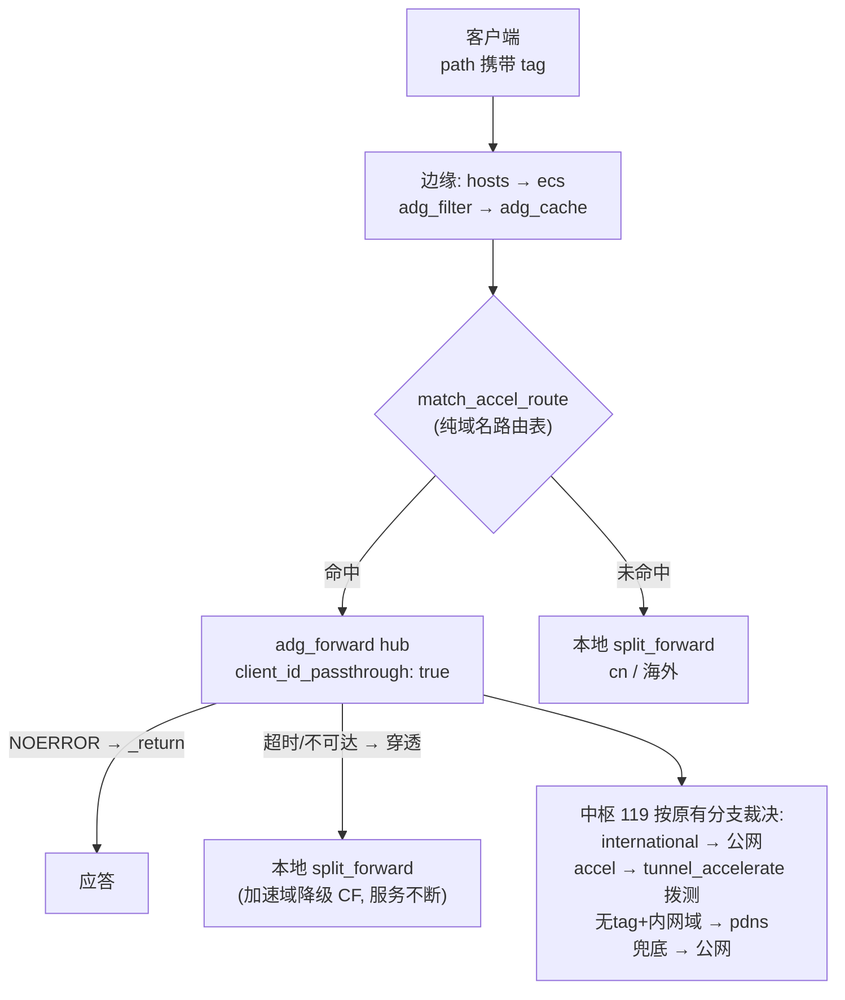

# 情境：中枢-边缘多节点架构

> 多节点部署时的整体形态：119 为唯一数据源中枢，其余节点为哑路由边缘。
> 各等级语义见 [README](./README.md)。

## 角色划分

| 角色 | 节点 | 职责 | 持有的数据 |
|------|------|------|-----------|
| 中枢 HUB | 119 | 按客户端 tag 裁决加速（pdns / 隧道拨测 / 公网回落），本地分流 | pdns + tunnel-hosts.txt（**全网唯一 IP 数据源**） |
| 边缘 EDGE | 211 及未来节点 | 广告过滤 / 缓存 / 按路由表把候选域转发中枢 | accel-route-domains.txt（**只有域名，无 IP**） |

设计原则：**易漂移的 IP 数据不出中枢，边缘零加速状态**。新增边缘节点 =
部署边缘配置 + 同步一份纯域名清单，不装 pdns、不复制隧道映射、不做拨测。

## 等级如何跨节点传播：client_id path 透传

客户端连边缘的 URL path 已经是 tag 集合（`/dns-query/accel/international` →
`clientIDs = ["accel", "international"]`，段数不限、顺序无关，见
[`doh-path.md`](../doh-path.md)）。边缘的 `adg_forward` 开启
`client_id_passthrough` 后，把这套 tag **动态拼到出站 URL path**，中枢按同样
语义裁决：

```
客户端 → 边缘: /dns-query/accel/international
边缘   → 中枢: https://hub:4215/dns-query/accel/international   ← tag 原样过境
中枢:   tunnel_accelerate / pdns / outdoor / 兜底 各分支独立匹配
```

选型记录：未采用 EDNS0 私有 option 携带等级——那需要在两端各加编解码 +
出口剥离防外泄，且日志不可读；path 通道只有边缘一端改动（一个开关）、中枢
零改动、访问日志直接可读。节点间链路是 DoH/DoQ，path 天然可用；若未来出现
UDP 中继再考虑 EDNS0 方案。

## 流程



## 边缘配置要点（完整样例见部署配置）

```yaml
data_providers:
  - tag: accel_route                     # 纯域名路由表（119 生成并分发）
    file: /etc/mosdns/accel-route-domains.txt
    auto_reload: true

plugins:
  - tag: match_accel_route
    type: query_matcher
    args:
      domain: ["provider:accel_route"]

  - tag: hub                             # 中枢上游：tag 动态透传
    type: adg_forward
    args:
      client_id_passthrough: true
      upstream:
        - addr: "https://hub.example:4215/dns-query"
      bootstrap: ["https://223.5.5.5/dns-query"]
      timeout: 10
```

```yaml
# default_sequence（cache 之后）
- if: match_accel_route
  exec:
    - hub
    - if: "[_response_noerror]"   # 中枢应答（含空抑制/回落结果）→ 结束
      exec: [_return]             # 超时/不可达 → 穿透本地 split 降级
```

边缘**不需要**：`tunnel_accelerate`、`ech_block`、`forward_pdns`、
`_response_noerror` 之外的中枢插件——加速逻辑全部集中在中枢。

## 新增等级的流程（以 international 为例）

1. 中枢 sequence 顶部加一个分支（`match_client_international → split_forward`）
2. 给目标人群分发 `/dns-query/international` 或组合 path（如
   `/dns-query/accel/international` 由中枢分支优先级决定实际策略）
3. **边缘节点零改动**——tag 经透传自动到达中枢

## 路由表生成（119 的 ofelia/update.sh 追加）

```sh
cat internal_accelerate-domains.txt > accel-route-domains.txt
awk '{print $1}' tunnel-hosts.txt | grep -v '^#' >> accel-route-domains.txt
sort -u accel-route-domains.txt -o accel-route-domains.txt
# 分发到各边缘 /etc/mosdns/accel-route-domains.txt
```

## 边界行为

| 情境 | 行为 |
|------|------|
| 中枢不可达 | 边缘穿透本地 split_forward，加速域降级 CF，服务不断 |
| 路由表条目在中枢已失效 | 中枢走自己兜底返回公网结果，边缘无感知 |
| 新增隧道/内网域名 | 只更新中枢数据 + 重生成路由表，边缘 auto_reload 生效 |
| 客户端多 tag 组合 | 集合语义，各分支独立匹配，无需枚举组合 |
